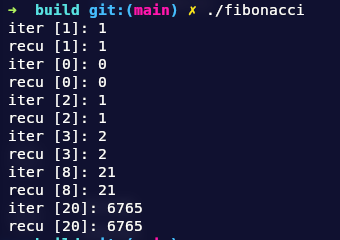
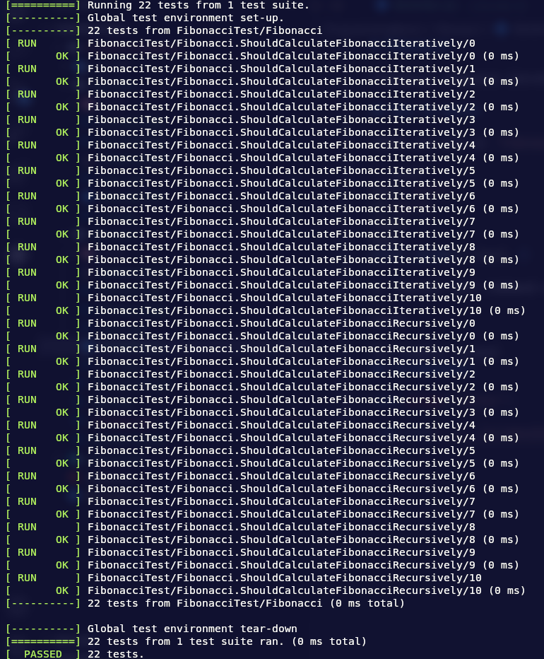

# Fibonacci

Fibonacci sequence iterative and recursive.

## How to build

*When you are in `fibonacci` directory.*

```bash
mkdir build
cd build
cmake ..
make
./fibonacci
GTEST_COLOR=1 ctest -V
```
or replace last command with
```
ctest
```
for simpler output
## Screenshots

<div align="center">




</div>
