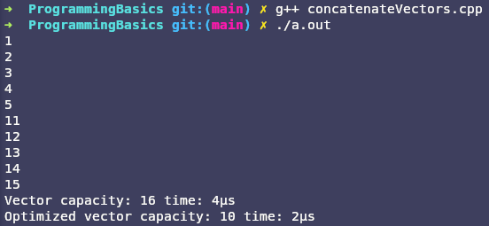
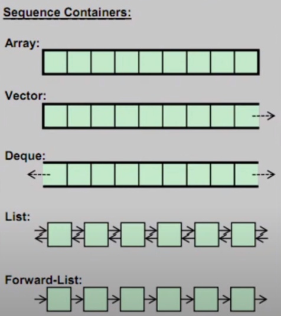
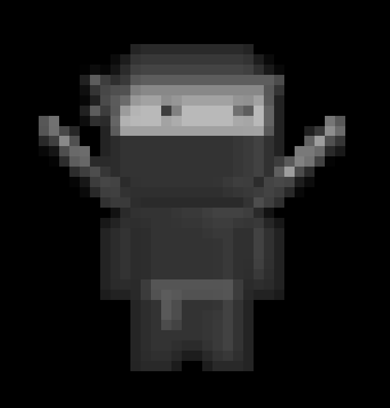

# CodersSchool 

This GitHub project contains my solutions to tasks and homework assignments from the Coderschool course.

In the Coderschool course, we engage in a variety of activities aimed at enhancing our skills and knowledge in software development. We participate in live online group meetings where we discuss various topics related to programming.
While the primary focus is on C++, the course covers a wide range of programming languages and technologies, including Python, databases, REST API, Docker. Moreover, emphasis is placed on developing soft skills such as project management, presentation skills, and communication, along with personal development and stress management.

Feel free to explore my solutions within this repository!

<b>This repository is not finished yet.</b>

## Tehnologies

## Contents

1. [Programming basics](./ProgrammingBasics/)
	- [print String](./ProgrammingBasics/printString.cpp) - Print a string $x$ times.
	- [max](./ProgrammingBasics/max.cpp) - Find max value from 3 numbers.
	- [multiply](./ProgrammingBasics/multiply.cpp) - Multiply 2 numbers.
	- [for loop test](./ProgrammingBasics/forLoopTest.cpp) - Add to array next odd numbers.
	- [calculate](./ProgrammingBasics/calculate) - (*README*) simple calculator with tests.
	- [fibanacci](./ProgrammingBasics/fibanacci) - (*README*) fibonacci sequence iterative and recursive.
	- [print vector](./ProgrammingBasics/printVector.cpp) - Print an elements of vector of strings.
	- [concatinate vectors](./ProgrammingBasics/concatinateVectors.cpp) - Concatinate two vectors. Contain an optimized and unoptimized version.
	- [create sorted list](./ProgrammingBasics/createSortedList.cpp) - Return a sorted list from random vector. Display the time of sorting a vector and a list.
	- [create map](./ProgrammingBasics/createMap.cpp) - Function take a vector and a list then return map with vector as keys and list as values.
	- [add even](./ProgrammingBasics/addEven) - (*README*) add every even number from vector.
	- [GCD and LCM](./ProgrammingBasics/GCD\&LCM) - (*README*) calculate GCD and LCM.
	- [generate sequence](./ProgrammingBasics/generateSequence/) - (*README*) generate a vector with sequence of numbers.
	- [max of vector](./ProgrammingBasics/maxOfVector/) - (*README*) return biggest number in vector.
	- [replace string](./ProgrammingBasics/replaceString.cpp) - replace string with another string using reference.
	- [change value of variable](./ProgrammingBasics/changeValueOfVariable.cpp) - showcase of pointer and reference.
	- [simple smart pointer](./ProgrammingBasics/simpleSmartPointer.cpp) - showcase of smart pointer.
	- [smart pointer multiplication](./ProgrammingBasics/replaceString.cpp) - showcase of smart pointer created in function.
	- [password check](./ProgrammingBasics/passwordCheck/) - (*README*) function that return an enum depend on if password fulfill specific rules.
	- [vector of shared pointers](./ProgrammingBasics/vectorOfSharedPointers/) - (*README*) Operations on ints stored by vector of shared pointers to int.

2. [Basics of programming tools](./BasicsOfProgrammingTools/)
	- [terminal magic](./BasicsOfProgrammingTools/TerminalMagic/) - basic of Linux commands.

3. [STL](./STL/)
	- [vector test](./STL/vectorTests.cpp) - A few functions from std::vector
	- [vector test2](./STL/vectorTests2.cpp) - reminder about size and capacity difference
	- [arrat test](./STL/arrayTests.cpp) - A few functions from std::array
	- [list test](./STL/listTests.cpp) - A few functions from std::list
	- [forward list test](./STL/forewardListTests.cpp) - A few functions from std::forward_list
	- [deque test](./STL/dequeTests.cpp) - A few functions from std::deque
	- [remove vowels](./STL/removeVowels/) - (*README*) Remove vowels from strings in vector
	- [length sort](./STL/lengthSort/) - (*README*) It is an insertion sort from forward_list to deque
	- [gray scale image](./STL/grayScaleImage/) - (*README*) Compresion and decompresion of raw pgm format

## Screenshots

