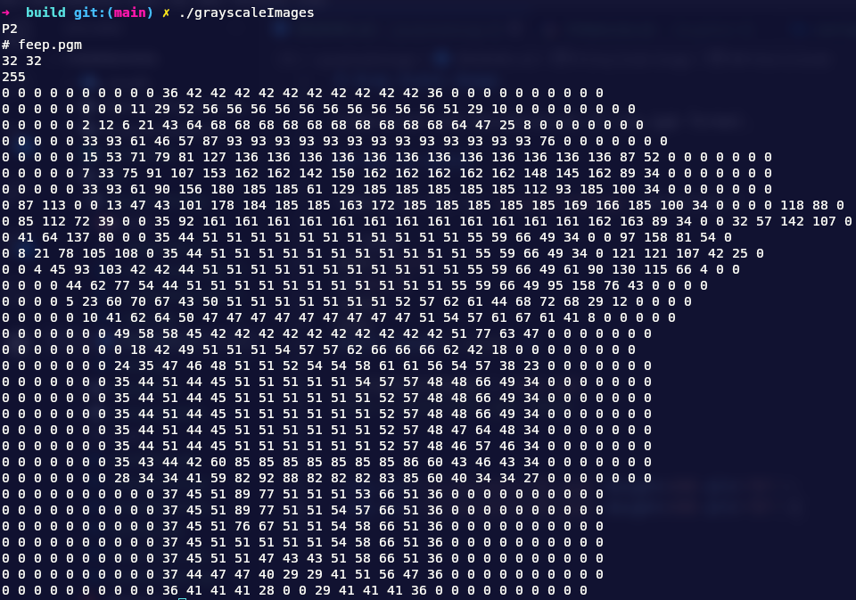

# Gray Scale Image

Compresion and decompresion of raw pgm format.

## How to build

*When you are in `grayScaleImage` directory.*

```bash
mkdir build
cd build
cmake ..
make
GTEST_COLOR=1 ctest -V

./grayScaleImage > name.pgm
#See a generated pgm image

```

<div align="center">




</div>
